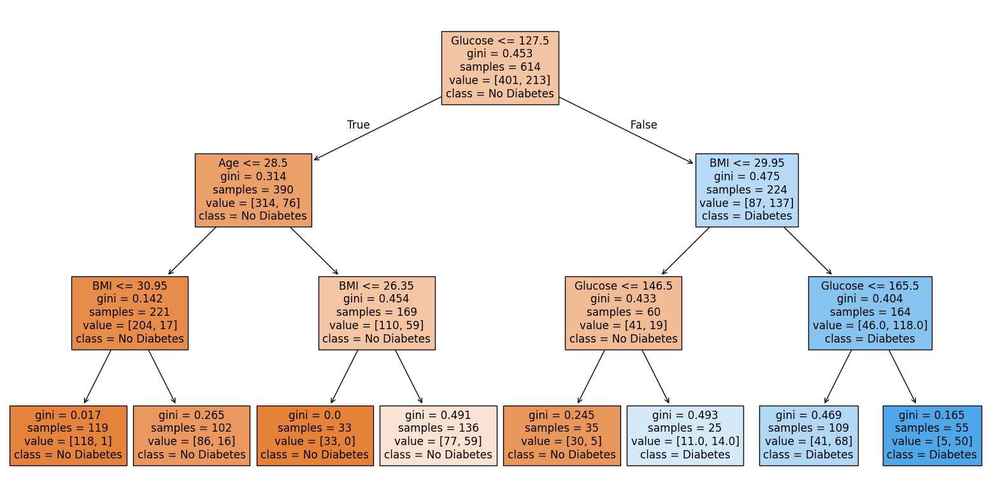

# Diabetes Prediction with Decision Trees

## Project Overview
This project addresses a supervised classification problem in a healthcare context: predicting whether a patient has diabetes based on diagnostic and demographic measurements. Beyond building a predictive model, the focus is on **data understanding, responsible data cleaning, and balancing predictive performance with interpretability**.

## Dataset
The dataset originates from the National Institute of Diabetes and Digestive and Kidney Diseases and contains 768 observations with the following variables:

- Pregnancies  
- Glucose  
- BloodPressure  
- SkinThickness  
- Insulin  
- BMI  
- DiabetesPedigreeFunction  
- Age  

The target variable is **Outcome**, indicating the presence (1) or absence (0) of diabetes.

**Source:**  
https://breathecode.herokuapp.com/asset/internal-link?id=421&path=diabetes.csv

## Exploratory Data Analysis (EDA)
A comprehensive EDA was conducted to examine data quality, feature distributions, and relationships with the target variable.

Key observations:
- Several medical variables (Glucose, BloodPressure, SkinThickness, Insulin, BMI) contain **zero values**, which are biologically implausible and likely represent missing data.
- The dataset is **moderately imbalanced**, with a higher proportion of non-diabetic patients.
- **Glucose** shows the strongest separation between diabetic and non-diabetic patients, followed by **BMI, Age, and Pregnancies**.
- Other variables present weaker discriminatory power.

Univariate, multivariate, and correlation analyses guided feature treatment and modelling decisions.

## Feature Engineering
- Zero values in clinically impossible variables were replaced with the **median of non-zero observations**.
- Outliers were identified using the **interquartile range (IQR)** method.
- Two datasets were created:
  - one retaining outliers
  - one with outliers capped at calculated limits  

Both versions were evaluated to assess their impact on model performance.

## Modelling Strategy

### Baseline Decision Trees
Two baseline Decision Tree classifiers were trained:
- using the dataset **with outliers**
- using the dataset **without outliers**

The dataset without outliers achieved higher accuracy (~0.75 vs ~0.73) and was selected for further modelling.

### Impurity Criterion Comparison
Both impurity measures were evaluated:
- **Gini index**
- **Entropy**

The **Gini criterion** consistently outperformed entropy on this dataset and was selected.

### Hyperparameter Optimisation
Model performance was further improved using **GridSearchCV**, tuning:
- `max_depth`
- `min_samples_split`
- `min_samples_leaf`

The final optimised model achieved approximately **76% accuracy** on both cross-validation and the test set.

## Model Interpretation
The final decision tree highlights **Glucose and BMI** as the most influential predictors, followed by Age and Pregnancies. The model remains fully interpretable, making it suitable for contexts where **explainability is essential**.

## Key Takeaways
- Rigorous EDA is critical when working with medical datasets.
- Treating missing or unrealistic values meaningfully improves model quality.
- Decision Trees provide a strong balance between **performance and interpretability**.
- Glucose and BMI are the most influential predictors of diabetes in this dataset.